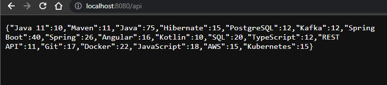
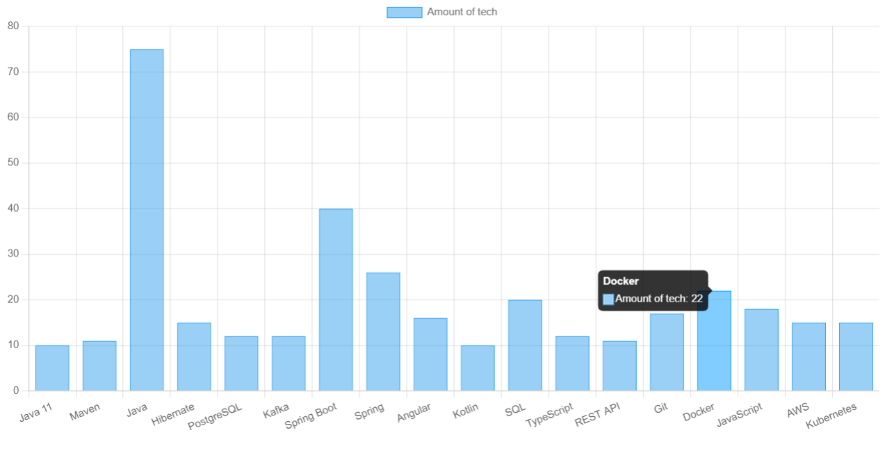

# Java jobs skills scraper
## Overview

This API is designed to aggregate and analyze job skills from job offers. It reads data from a JSON file containing job offers, extracts the required skills for each job, counts the occurrences of each skill, and then returns the skills that have been mentioned in at least 10 job offers.

## Dependencies

- Spring Framework (for the web controller)
- Jackson (for JSON processing)

## API Endpoints

### `GET /api`

- **Purpose**: Fetches the skills mentioned in the job offers and returns those with at least 10 occurrences.
- **Response**: A map of skills with their counts.

Example:
```json
{
  "Java": 15,
  "Spring": 12,
  "Docker": 10
} 
```



## Chart

